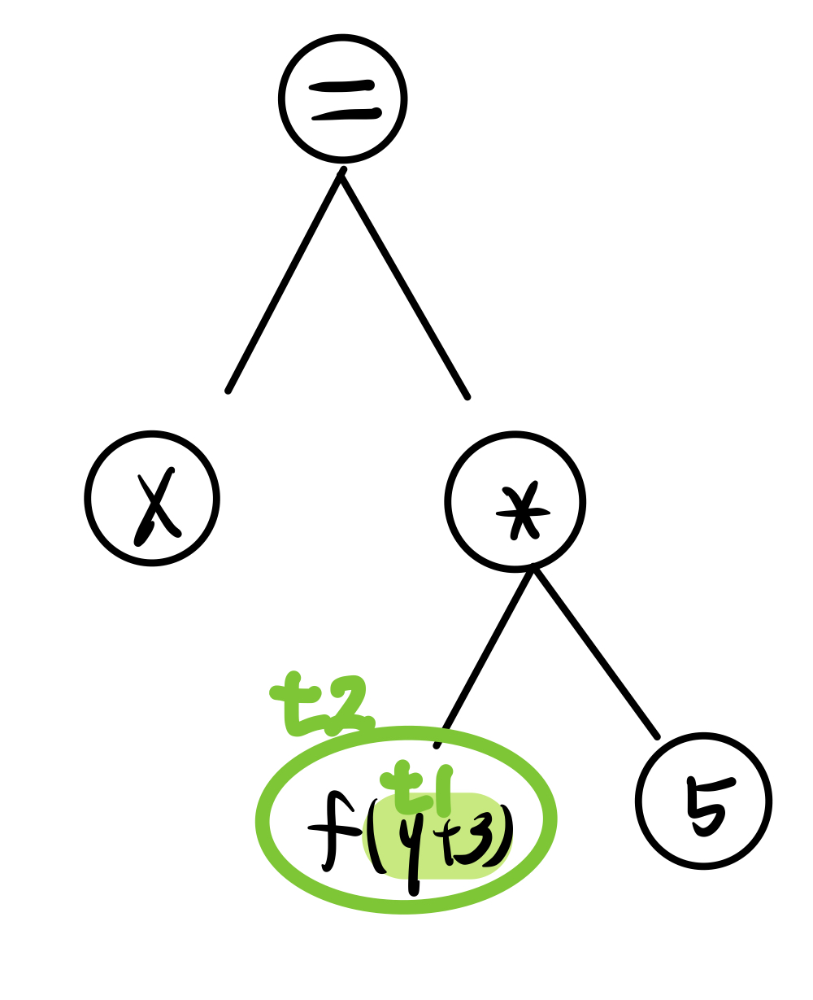

# A Tiny Imperative Programming Language

## 2.1 The Syntax of TIP

### Intro
- 정적 분석을 위한 프로그래밍 언어, TIP를 알아본다. 
- TIP 프로그램 구성은 정수 스트림 입/출력으로 이루어진다.
- 기존 언어와 달리 기능(전역 변수, 중첩 함수, 객체 등)은 별로 없다.

### Basic Expressions
- `Int`, `Id`(변수? 인덱스?), `Exp`(+, -, *, / , >, ==, ( ) )
- 0 is `FALSE`, 1 is `TRUE`

### Statements

```
Id = Exp;    // 대입
output Exp; // 출력 결과 : Stm Stm | TIP에서의 출력문은 output 키워드 사용

if (Exp) {
    Stm
    } 
[else {Stm}] // 조건문

while (Exp) {Stm}           // 반복문
```

### Functions *함수 구성*
```
Id (Id, ... , Id) {   // 함수명 (매개변수 목록)
    [Var Id, ... Id;] // 로컬 변수 선언
    return Exp;       // 리턴문
}
```

### Functions as Values *함수도 변수(당연히)*

### Pointers
```
/* Example Code*/

x = alloc null; // 힙 영역에 공간 할당
y = &x          // 포인터 생성(주소값 대입)
*x = 42;        // 포인터 참조
z = **y         // 포인터 역참조(= load operation)
```

### Records (*딕셔너리 구조랑 비슷*)
{`필드`} == {`이름`:`값`}
```
x = {f: 1, g: 2};  // 레코드 생성
y = &x;            // 포인터 생성(주소값 대입)
x.f = 3;           // {f: 3, g: 2} 로 수정
(*y).g = 4;        // {f: 3, g: 4} 로 수정 (참조&필드 접근)
```

## 2.3 Normalization, *정규화* & 2.4 Abstract Syntax Trees, *ASTs*
- 정적 분석을 위해서는 간단한 프로그래밍 언어로 작업하는 게 편리함
- **중첩된 포인터식 정리**가 핵심
- **함수 프로토타입**도 주로 `함수명_식아님(파라미터_식아님, ...)` 형태

Syntax Tree 랑 같이 보자.

```
// example
x = f(y + 3) * 5;

// can be normalized to
t1 = y + 3;
t2 = f(t1);
x = t2 * 5;
```
<br>

 <br>

### TIP 프로그래밍 언어의 제한 항목
TIP는 명시적인 타입 선언을 할 수 없으며, 특정 종류의 값에만 적용되는 연산도 있다. 
- 산술 연산 및 비교는 정수에만 적용된다.
- control structures는 정수여야 한다.
- main 함수의 입출력은 정수만 가능하다.
- 정확한 인수로서, 함수만 호출할 수 있다.
- 단항 연산자 *는 포인터(또는 NULL)에만 적용된다.
- 필드 접근은 레코드에 대해서만 가능하다.