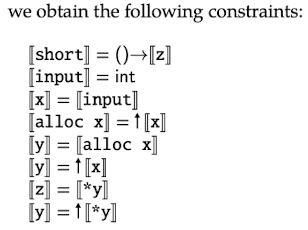
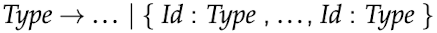
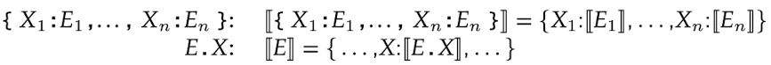
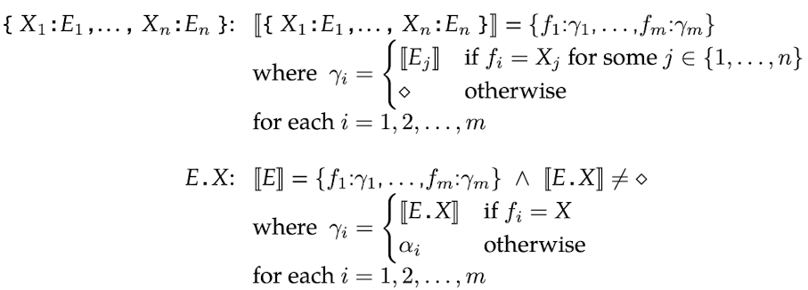

# Type Analysis

**근삿값**에 의존해야함에 따라, AST에서 파생된 제약 조건을 만족하는 경우 **프로그램을 유형화**할 수 있다. <br>

TIP와 같은 정적 유형 검사(Static Type Checking)를 사용하며, 모든 변수와 함수에 대한 형식 주석(Type aanotations)을 제공해야 한다. <br>

하지만 TIP에는 유형(주석)이 없으므로, 지금부터 진행할 Type Analysis는 **프로그램에서 변수와 함수가 사용되는 방식**을 기반으로 **모든 유형을 추론**해야 한다. <br>

> <span style="color:gray">TIP에서 지역변수의 초기값을 정의되지 않지만, Type Analysis의 경우 모든 변수가 사용되기 전에 초기화된다고 가정한다.</span> 

## 3.1 Types
Types that will describe **possible values**. <br>
<br>

`int` : **정수형** <br>
`↑Type` : **포인터형** <br>
`(Type, ..., Type) → Type` : **함수형** <br>
이 문법은 일반적으로 유한한 형식이지만, **재귀함수와 데이터 구조**를 위해서는 **정규형이 필요**하다(정규트리 기반). <br>

재귀 함수를 간결하게 표현하기 위해 `μ 연산자`와 `타입`을 적는다. <br>
<br>

이 표기법을 통해 재귀함수는 다음과 `μt.(int,t)→int`와 같이 표현할 수 있다.<br>

또한 자유 변수(즉 μ로 쓰지 않는 변수)를 사용할 수 있는데, 이러한 변수는 모든 유형을 나타낸다. <br> 
예를 들어, 
```
store(a, b) {   // type(t, t) → int 와 같다.
    *b = a;
    return 0;
}
```
store(a, b)는 `type(t, t) → int`형이며, 여기서 t는 임의의 타입을 가질 수 있는 자유형 변수이다.

## 3.2 Type Constraints
**정규항에 대한 타입 제한**(**Type Constraints**)을 고려해보자. 타입 제한 조건은 **통일 알고리즘**(**unification algorithm**)을 통해 효율적으로 해결할 수 있다. <br>
각 지역변수&파라미터&함수이름 X에 대해 타입 변수 [X]로 대체하고, 비식별자 표현 E(AST의 노드)에 대해 [E]로 대체한다. <br>

예시,
```
short() {
    var x, y, z;   
    x = input;     
    y = alloc x;   
    *y = x;
    z = *y;
    return z;
}
```
<br>

## 3.3 Solving Constraints with Unification
정규항에 대해 통일 알고리즘을 사용하면 타입 분석을 선형시간(`O(n)`)에 계산할 수 있다. <br>
앞으로 사용할 통일 알고리즘은 `union-find data structure(also called a disjoint-set data structure)`에 기반한 것이며, 이 데이터 구조는 **각각의 노드가 자신의 부모노드에 정확히 하나의 Edge를 갖는 그래프**로 구성된다(이진트리와 유사). 두 노드가 똑같은 조상을 가질 경우 동등한 클래스이며, and each root is the canonical representative of its equivalence class. 통일 알고리즘은 다음의 세 가지 과정이 존재한다. <br>

- `MakeSet(x)` : 초기에 부모 노드 x를 추가한다. 
- `Find(x)` : 루트로 가는 경로를 따라, canonical representative of x를 찾는다. (각 노드의 부모가 canonical representative)
- `Union(x, y)` : x, y의 canocical representative를 찾고, 다를 경우 다른 부모로 하나 만든다.


```
/* In pseudo-code */

procedure MakeSet(x)
  x.parent := x   // 부모 노드 설정
end procedure

procedure Find(x)
  if x.parent != x then // x의 부모 노드 찾기
     x.parent := Find(x.parent)
  end if
     return x.parent
end procedure

procedure Union(x, y)
  pow(x, r) := Find(x)
  pow(y, r) := Find(y)
  if pow(x, r) != pow(y, r) then
    pow(x, r).parent := pow(y, r)
  end if
end procedure
```

## 3.4 Record Types
**Record**를 사용하는 프로그램에서도 타입 분석을 하기 위해 레코드 타입 언어를 정의한다. <br>

<br>

예를 들어, 레코드 타입 `{a:int, b:int}`는 두 필드(둘 다 정수)를 갖는다. 필드의 이름 집합(앞에 경우 a, b)이 서로 다른 레코드 타입은 서로 다른 term constructors로 간주된다. <br>

목표는 다른 종류의 에러를 프로그램을 통해 확인할 수 있도록 하는 것이다. 즉 레코드 타입의 다른 종류의 값들과 구별할 수 있어야 한다. <br>

먼저, 레코드의 구성과 필드에 대한 제한 조건으로 포인터&역참조를 통해 다음과 같이 표현할 수 있다. 

<br>

그러나 이 제한 조건의 우항으로는 language of Types로 직접 표현할 수 없다. 통일 알고리즘을 수정하지 않고 language of Types를 표현하기 위해서는, 모든 레코드 타입이 모든 레코드 필드를 포함한다고 전제하고 부재 필드를 나타내는 특수 타입 `♢`를 쓰는 것이다. <br>
`Type → ... | ♢`, 또한 위의 제한 조건 대신 다음 두 가지 제한 조건을 쓴다. <br>

<br>

## 3.5 Limitations of the Type Analysis

타입 분석은 당연히 근사값일 뿐이며, 타입 분석만으로는 특정 프로그램이 작동되지 않을 수 있다. <br>

for example 1, 
```
f() { 
    var x;
    x = alloc 17;
    x = 42;
    return x + 87;
}
```
이 프로그램은 런타임 에러는 없지만, 분기문 부족(flow-insensitive) 등으로 인해 Type Checker에 의해 동작하지 않는다. 자세히, `return x + 87;`에서 x가 정수여야 한다는 사실이 이전 프로그램 명령어 줄에 의해 배제된다. <br><br>

for example 2,
```
f(x) {
  return *x; 
}
main() {
  return f(alloc 1) + *(f(alloc(alloc 2));
}
```

이 프로그램 역시 런타임 에러는 없지만, main() 함수를 분석 할 때 인수 타입에 따라 타입을 인스턴스화(instantiate)할 수 있다. `return f(alloc 1) + *(f(alloc(alloc 2));`에서 `f(alloc 1)` 호출은 인수가 `type(↑int)→int`의 제한 조건을 갖고, `(f(alloc(alloc 2));`호출은 인수가 `type(↑↑int)→int`의 제한 조건을 갖는다. <br>
<span style="color:gray">자세한 내용은 8.2절 a closely related program analysis mechanism (called context-sensitivity)에서..</span>


