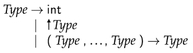
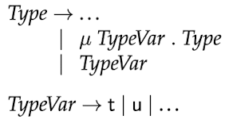

# Type Analysis

**근삿값**에 의존해야함에 따라, AST에서 파생된 제약 조건을 만족하는 경우 **프로그램을 유형화**할 수 있다. <br>

TIP와 같은 정적 유형 검사(Static Type Checking)를 사용하며, 모든 변수와 함수에 대한 형식 주석(Type aanotations)을 제공해야 한다. <br>

하지만 TIP에는 유형(주석)이 없으므로, 지금부터 진행할 Type Analysis는 **프로그램에서 변수와 함수가 사용되는 방식**을 기반으로 **모든 유형을 추론**해야 한다. <br>

> <span style="color:gray">TIP에서 지역변수의 초기값을 정의되지 않지만, Type Analysis의 경우 모든 변수가 사용되기 전에 초기화된다고 가정한다.</span> 

## 3.1 Types
Types that will describe **possible values**. <br>
<br>

`int` : **정수형** <br>
`↑Type` : **포인터형** <br>
`(Type, ..., Type) → Type` : **함수형** <br>
이 문법은 일반적으로 유한한 형식이지만, **재귀함수와 데이터 구조**를 위해서는 **정규형이 필요**하다(정규트리 기반). <br>

재귀 함수를 간결하게 표현하기 위해 `μ 연산자`와 `타입`을 적는다. <br>
<br>

이 표기법을 통해 재귀함수는 다음과 `μt.(int,t)→int`와 같이 표현할 수 있다.<br>

또한 자유 변수(즉 μ로 쓰지 않는 변수)를 사용할 수 있는데, 이러한 변수는 모든 유형을 나타낸다. <br> 
예를 들어, 
```
store(a, b) {   // type(t, t) → int 와 같다.
    *b = a;
    return 0;
}
```
store(a, b)는 `type(t, t) → int`형이며, 여기서 t는 임의의 타입을 가질 수 있는 자유형 변수이다.

## 3.2 Type Constraints
**정규항에 대한 타입 제한**(**Type Constraints**)을 고려해보자. 타입 제한 조건은 **통일 알고리즘**(**unification algorithm**)을 통해 효율적으로 해결할 수 있다. <br>
각 지역변수&파라미터&함수이름 X에 대해 타입 변수 [X]로 대체하고, 비식별자 표현 E(AST의 노드)에 대해 [E]로 대체한다. <br>

For example,
```
short() {
    var x, y, z;   
    x = input;     
    y = alloc x;   
    *y = x;
    z = *y;
    return z;
}
```
```
[short] = ()→[z] 
[input] = int
[x] = [input] 
[alloc x] = [x] 
[y] = [alloc x] 
[y] = [x]
[z] = [*y] 
[y] = [*y]
```

## 3.3 Solving Constraints with Unification

## 3.4 Record Types 

## 3.5 Limitations of the Type Analysis

