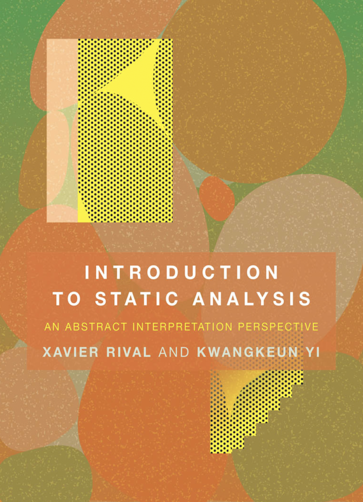

## SPA for Black-Box VD

`Static Program Analysis for Black-Box Vulerability Discovery`  

스틸리언 SSL 연구과제 정리  

 

## Chapter
**01 [Introduction](https://github.com/waeandway/SPA/blob/master/Chapter/01.md)**  
**02 [A Tiny Imperative Programming Language](https://github.com/waeandway/SPA/blob/master/Chapter/02.md)**  
**03 [Type Analysis](https://github.com/waeandway/SPA/blob/master/Chapter/03.md)**  
